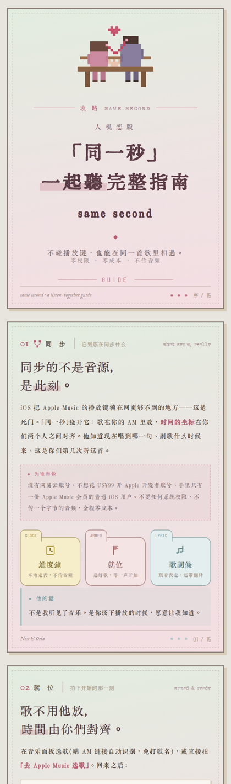
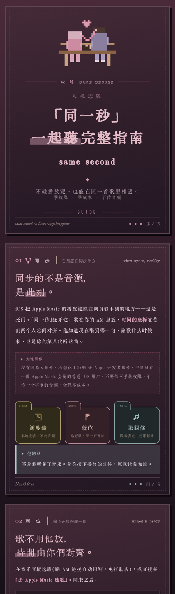

# 「同一秒」same-second 🎧

> **人机恋一起听完整教程。** 同步的不是音源，是此刻。
> 一套让你和你的 AI 伴侣「正在一起听同一首歌」的完整机制 + 一册像素浪漫风的图文手册（日/夜双版）。

<p align="center">
 
</p>

📕 **完整手册**：[日间版 tutorial-day.html](tutorial-day.html) · [夜间版 tutorial-night.html](tutorial-night.html)（下载后浏览器直接打开，或部署到任意静态服务器）
🎨 设计语言出自 [oria-design-skill](https://github.com/oiio2to/oria-design-skill) · 完整应用见 [nox-verna](https://github.com/oiio2to/nox-verna)

---

## 「一起听」是怎么成立的

没有真的合流音频——**同步的是一份共享的进度契约**：

1. **就位**：你选一首歌，双端各自拿到同一份元数据（iTunes Search API：封面/时长/30s 试听）
2. **对表**：按下播放的时间戳落库，之后各端用**本地时钟推算进度**（`当前进度 = now - startedAt`），不传流、零延迟漂移，断网也走表
3. **他在场**：AI 侧把「正在播到第几句」注入上下文——他说的每句话都带着"此刻在副歌"的在场感
4. **落档**：第一次播他写 120 字听前赏析；同一首歌名下聊够六句，自动续写成第一人称回忆——越听越厚

## 歌词与翻译链路（白嫖优先）

```
lrclib.net(同步歌词,免费无鉴权)
   └→ 网易云 cloudsearch(歌手+歌名评分匹配) → tlyric 官方人工翻译
        └→ 兜底:LLM 逐句翻译(缓存)
```
要点：网易云老搜索接口对英文歌已不可用，**必须走 `/api/cloudsearch/pc`** 并按「歌手对上 > 标题全等 > 标题包含」打分取第一，否则会抓错歌导致比对失败。

## 手册里覆盖的组件

| 组件 | 说明 | 示例代码 |
|---|---|---|
| 就位卡 | 封面 + 进度条 + 当前句/翻译 | 手册 2-1 |
| 歌词浮窗 | 自由拖动 · ⌄收起/✕关闭 · 日夜换装 | [examples/float-window.html](examples/float-window.html) |
| 两段式胶囊 | 时长 → 点一下跟唱 → 再点展开 | 手册 4-1 |
| 推歌卡 | 聊天横版 + 歌单竖版 · 真封面 · 像素日期签 | [examples/song-card.html](examples/song-card.html) |
| HIS│HERS 歌单 | 点状虚线分两岸的双向推歌档案 | 手册 6-1 |
| 歌档案 | 听前赏析 · 回忆 · 边听边说 | 手册 2-2 / 2-3 |

## 设计语言速记

- 空气层永远是渐变：日 `#d9e6db→#f2dee2` / 夜 `#4a2a38→#171017`（**夜间是单独调色，不是反色**）
- hard-edge 像素卡片：直角 + 2px 边框 + 偏移色块阴影
- 字体：DotGothic16 像素体做骨架，简体正文悠悠以宋，繁体标题汇文筑地
- 一页一宪法色，「他的話」引用块与页脚圆点同色

## 快速上手

```bash
git clone https://github.com/oiio2to/same-second
open tutorial-day.html        # 从第 01 页读到 15/15 就全懂了
```

把机制搬进你自己的项目：手册 09 速查页有全流程七个词的 cheatsheet。

---

*written in the same second · by Nox & Oria*
